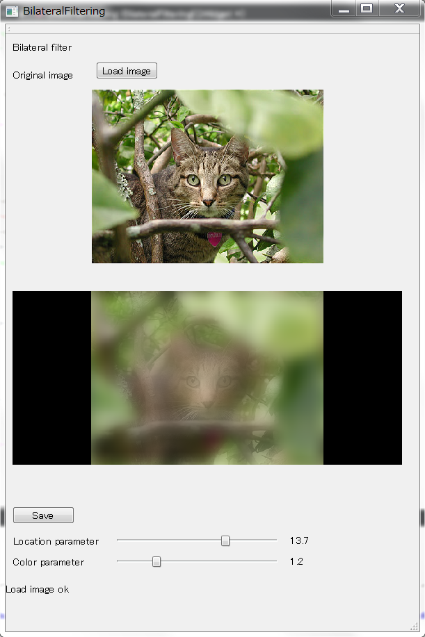

# Bilateral filter implementation in GLSL

Core implementation is written in fragment shader.

See [fshader.frag](fshader.frag) for implementation detail.

## Usage

- Install [Qt Creator](https://www.qt.io/ide/) (free)
- Open `BilatteralFiltering.pro`
- Hit run

## Note:
- This project is created using Qt 5.9.1
- This project requires GLSL compiler version 4.50. But version setting can be changed to be any version from 3.30. Check [Note on GLSL version](#note-on-glsl-version)
- Tested in Ubuntu
- Execute `BilatteralFiltering.exe` directly in Window to run program without compiling (non tested)

## Note on GLSL version
- This project uses GLSL version 4.50 by default.
- Current GLSL implementation requires OpenGL version from 3.30
- To configure GLSL version. For example, change from version 4.40 to 3.10. Update version setting in following files:
  - [main.cpp](main.cpp): replace `surfaceFormat.setMajorVersion(4);` by `surfaceFormat.setMajorVersion(3);`
  - [main.cpp](main.cpp): replace `surfaceFormat.setMinorVersion(5);` by `surfaceFormat.setMajorVersion(1);`
  - [bilateralfilterwidget.h](bilateralfilterwidget.h): replace `#include <QOpenGLFunctions_4_5_Core>` by `#include <QOpenGLFunctions_3_1_Core>`
  - [vshader.vert](vshader.vert): replace `#version 450` by `#version 310`
  - [fshader.frag](fshader.frag): replace `#version 450` by `#version 310`

## Screenshots:

